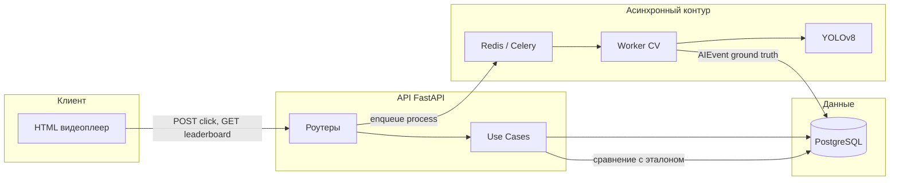

# Live Event Game — прототип интерактивной трансляции с AI-эталоном

Документ предназначен для технического ревью: в нём описана **концепция продукта**, **архитектура**, **обоснование стека** и **инструкция по запуску**. Акцент сделан на роли **AI Orchestrator** — интеграции модели компьютерного зрения, фоновых воркеров и синхронного API в единый согласованный контур.

---

## 1. Концепция игры

**Идея.** Зрители смотрят запись (в прототипе — локальный MP4, например футбольный матч) и в ключевые моменты (в демо — **гол**) нажимают кнопку **«Событие!»**. Клиент фиксирует **`currentTime`** видеоплеера и отправляет его на сервер как момент реакции пользователя.

**Эталон времени (Ground Truth).** Отдельный **офлайн-пайплайн** просматривает то же видео, детектирует мяч (YOLO, класс COCO «sports ball»), отслеживает попадание центра bbox в **ROI ворот** и с антидребезгом записывает в БД события типа `goal` с **`timestamp_sec`** — эталонными секундами от начала ролика.

**Начисление очков.** Для каждого клика сервер находит **ближайшее** к моменту клика AI-событие `goal`, сравнивает время пользователя с эталоном и считает очки по **квадратичному затуханию** (чем ближе к эталону, тем больше максимум `p_max` в окне `window`). Итог агрегируется в **турнирную таблицу** (лидерборд по сумме очков).

Таким образом, игра сочетает **человеческую реакцию** и **автоматическую валидацию** через CV, без ручной разметки каждого гола.

---

## 2. Архитектура решения

### 2.1. Clean Architecture (слои)

Код разделён так, чтобы **бизнес-логика** не зависела от фреймворка и от деталей БД:

| Слой | Каталог | Ответственность |
|------|---------|------------------|
| **Presentation** | `src/api/` | FastAPI-роутеры, Pydantic-схемы, HTTP, CORS, раздача статики |
| **Application / Use Cases** | `src/use_cases/` | Скоринг (`calculate_score`), сценарий «клик → поиск эталона → сохранение `UserAction`» |
| **Domain** | `src/domain/` | Порты репозиториев (Protocol) без импорта SQLModel |
| **Infrastructure** | `src/infrastructure/` | SQLModel-модели, async-сессии (`asyncpg`) для API, sync-сессии (`psycopg2`) для воркера, реализации репозиториев |

Так проще тестировать сценарии начисления очков и подменять хранилище, не трогая HTTP-слой.

### 2.2. Логическое разбиение на «микросервисы»

В прототипе всё в одном репозитории, но **процессы разделены** как в микросервисной схеме:

1. **API-сервис** (Uvicorn + FastAPI) — регистрация, приём кликов, лидерборд, постановка задачи на анализ видео.
2. **Worker-сервис** (Celery) — тяжёлый CPU/GPU-проход по видео, вызов YOLO, запись `AIEvent`, флаг `Stream.is_processed_by_ai`.
3. **PostgreSQL** — единый источник правды: пользователи, стримы, AI-события, история кликов и очков.
4. **Redis** — брокер и backend результатов Celery (очередь задач, статусы).

Такой расклад типичен для **оркестрации AI**: API остаётся отзывчивым, а инференс и обработка медиа выносятся в асинхронный контур.

### 2.3. Поток данных (упрощённо)



---

## 3. Обоснование выбора технологий

### 3.1. FastAPI

- **Асинхронный I/O** с `asyncpg` — хорошо масштабируется при множестве одновременных зрителей (клики, опрос лидерборда).
- **Pydantic v2** и автоматическая OpenAPI-документация ускоряют прототипирование и контракт с фронтом.
- Лёгкая интеграция **статической раздачи** (`/`, `/videos/`) для демо без отдельного фронтенд-сборщика.

### 3.2. Celery + Redis

- Анализ видео (декодирование, построение кадров, **YOLO**) — **долгая и ресурсоёмкая** задача; держать её в обработчике HTTP нецелесообразно (таймауты, блокировка воркеров Uvicorn).
- **Celery** даёт **очередь задач**, повторные попытки, горизонтальное масштабирование воркеров.
- **Redis** как брокер — низкая латентность, простой деплой в связке с Docker; при росте нагрузки брокер можно заменить на RabbitMQ без смены кода задач.

Это прямое проявление **оркестрации**: API лишь **инициирует** пайплайн (`POST .../streams/{id}/process`), а исполнение и запись эталона происходят **асинхронно и надёжно**.

### 3.3. OpenCV и Ultralytics YOLO — валидация событий

- **OpenCV (`cv2.VideoCapture`)** — стабильное чтение MP4, доступ к **таймкоду кадра** (`CAP_PROP_POS_MSEC`) для согласования событий с таймлайном видео.
- **Децимация кадров** (~обработка **5 кадр/с**) — разумный компромисс точность/стоимость.
- **YOLOv8 (COCO, класс 32 — мяч)** даёт bbox; **центр bbox** проверяется на вхождение в **ROI ворот**. Событие **«гол»** генерируется при **пересечении границы** (переход «снаружи ROI → внутрь») с **антидребезгом** (не чаще чем раз в ~2.5 с), чтобы не плодить дубликаты.

Итог: **«ИИ» здесь — это не текстовая LLM**, а **дискриминативная модель компьютерного зрения**, которая формирует **Ground Truth** для честного скоринга. Это хорошо масштабируется: тот же каркас можно подключить к **детекции других классов**, **трекерам**, или в будущем — к **мультимодальным моделям** (например, аудио + видео для событий).

### 3.4. Роль LLM и «AI Orchestrator» в этом проекте

В текущем прототипе **большие языковые модели (LLM) не используются** — события извлекаются **детерминированно** из правил на базе YOLO + геометрии ROI.

С точки зрения **AI Orchestrator** проект демонстрирует:

- **Разделение ответственности**: онлайн-API и офлайн/асинхронный ML-пайплайн.
- **Единая модель данных**: эталонные `AIEvent` и пользовательские `UserAction` согласованы по **`stream_id`** и времени.
- **Контролируемый контракт**: API знает, как интерпретировать результат воркера (тип `goal`, `timestamp_sec`), а use case — как математически оценить клик.

Для следующего шага оркестратор мог бы **подключить LLM** для генерации комментариев, сложной разметки или агрегации нескольких сигналов (CV + ASR + статистика матча) — текущая архитектура (очередь + БД + слой use cases) этому не противоречит.

### 3.5. PostgreSQL и SQLModel

- **PostgreSQL** — надёжно для конкурентных записей лидерборда и связей FK (`User`, `Stream`, `AIEvent`, `UserAction`).
- **SQLModel** совмещает модели таблиц и типизацию; **asyncpg** в API и отдельный **sync**-доступ в Celery — распространённый и понятный компромисс.

---

## 4. Локальный запуск прототипа

### Вариант A: Docker Compose (рекомендуется)

**Требования:** Docker + Docker Compose.

1. Склонируйте репозиторий и перейдите в корень проекта.
2. Положите видео в каталог `videos/`, например `videos/penalty.mp4` (имя должно совпадать с записью `Stream` в БД; при первом старте API может создать демо-запись с `filename=penalty.mp4` — см. код `src/api/main.py`).
3. Запуск:

```bash
docker compose up --build
```

4. Откройте в браузере: **http://localhost:8000**
5. Чтобы появился **эталон голов** в БД, после старта вызовите (подставьте `stream_id` из `GET http://localhost:8000/api/streams`):

```http
POST http://localhost:8000/api/streams/{stream_id}/process
```

Ответ **202 Accepted** означает, что задача поставлена в очередь Celery. Дождитесь логов воркера; поле `Stream.is_processed_by_ai` станет истинным после успешной обработки.

**Отладочное видео с ROI и bbox:** в `docker-compose.yml` для сервиса `celery_worker` можно выставить `YOLO_DEBUG_MODE: "1"` — результат по умолчанию пишется в том же volume `api_data` (путь задаётся `YOLO_DEBUG_OUTPUT`, по умолчанию `/app/data/debug_output.mp4`).

**Настройка ROI:** прямоугольник ворот задаётся в `src/workers/video_pipeline.py` (`DEFAULT_GOAL_ROI`). Для реального ролика его нужно **подогнать под разрешение и кадр**.

### Вариант B: Запуск без Docker (для разработки)

**Требования:** Python 3.11+, установленные **PostgreSQL** и **Redis**, файл `.env` или переменные окружения по образцу `src/core/config.py`:

- `DATABASE_URL` — `postgresql+asyncpg://...`
- `DATABASE_URL_SYNC` — `postgresql://...` (для Celery)
- `CELERY_BROKER_URL`, `CELERY_RESULT_BACKEND` — Redis
- `VIDEO_STORAGE_PATH` — путь к каталогу с mp4 (например `./videos`)

Команды (из корня репозитория, `PYTHONPATH=. ` или установка пакета в editable при необходимости):

```bash
pip install -r requirements.txt
uvicorn src.api.main:app --reload --host 0.0.0.0 --port 8000
```

В отдельных терминалах:

```bash
celery -A src.core.celery_app worker --loglevel=info
```

Убедитесь, что модель YOLO (`yolov8n.pt`) доступна среде (при первом запуске Ultralytics может загрузить веса автоматически).

---

## 5. Основные HTTP-эндпоинты

| Метод | Путь | Назначение |
|--------|------|------------|
| `POST` | `/api/users/register` | Регистрация пользователя |
| `GET` | `/api/streams` | Список трансляций |
| `POST` | `/api/streams` | Создание трансляции (title, filename) |
| `POST` | `/api/streams/{id}/process` | Постановка задачи CV-анализа в Celery |
| `POST` | `/api/game/click` | Клик пользователя (`user_id`, `stream_id`, `click_timestamp_sec`) |
| `GET` | `/api/game/leaderboard` | Турнирная таблица |

Документация API в режиме разработки: **http://localhost:8000/docs**

---

## 6. Итог для работодателя

Прототип показывает способность **спроектировать сквозной сценарий**: от **браузерного плеера** до **асинхронного ML-пайплайна** и **прозрачного скоринга** на основе **автоматического эталона**. Архитектура допускает замену модели (другой детектор/трекер), добавление новых типов событий и подключение дополнительных «умных» сервисов без переписывания ядра правил начисления очков.
